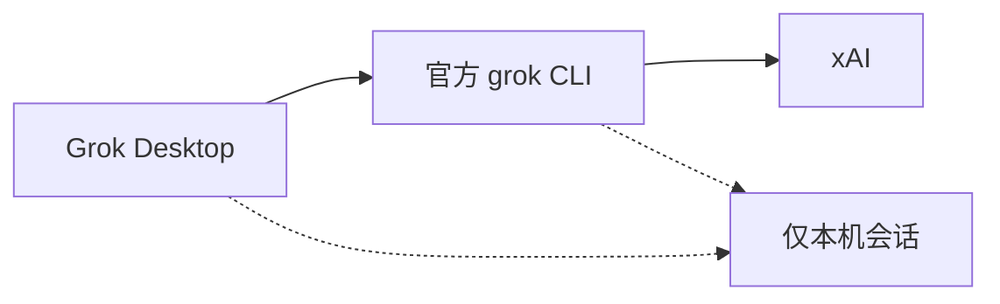

<div align="center">


# Grok Desktop 0.1.9

**官方 Grok CLI 的独立桌面工作区**

[](https://github.com/AvaterXXX/grok-desktop/releases)
[](https://github.com/AvaterXXX/grok-desktop/releases)
[](https://github.com/AvaterXXX/grok-desktop/stargazers)
[](#from-source)

### 喜欢就点一颗 Star

如果这个桌面端帮到你，请点右上角 **Star**。星星是这个社区叉最好的反馈。

[⬇️ 下载 Windows 绿色版](https://github.com/AvaterXXX/grok-desktop/releases/latest) · [更新日志](./CHANGELOG.md) · [Issues](https://github.com/AvaterXXX/grok-desktop/issues)

</div>

---

## 隐私

> **本应用不收集、不上传、不记录任何账号 / 对话 / 路径 / 使用数据。**
> 无遥测、无分析、无崩溃上报。登录只走本机官方 `grok` CLI。
> 会话只留在本机，桌面端不会向外发送使用数据。

- 账号与额度由本机已登录的官方 Grok CLI 管理
- 对话与会话只存在本机（CLI 会话目录 + 桌面本地设置）
- 删除会话只清本地列表，不会拿你的数据去换云端同步
- 本仓库 **不是** xAI 官方产品

---

## 仓库数据

| 项目 | 实时徽章 |
|------|----------|
| 最新 Release | [](https://github.com/AvaterXXX/grok-desktop/releases) |
| 累计下载 | [](https://github.com/AvaterXXX/grok-desktop/releases) |
| 本版下载 | [](https://github.com/AvaterXXX/grok-desktop/releases/latest) |
| Stars | [](https://github.com/AvaterXXX/grok-desktop/stargazers) |
| Forks | [](https://github.com/AvaterXXX/grok-desktop/network/members) |
| 源码 | [](https://github.com/AvaterXXX/grok-desktop) |
| 平台 | [](#from-source) |

**仓库只提供 Windows 便携 exe。** Linux / macOS 请自行构建。

---

## 架构



桌面端是套在官方 CLI 外面的本机壳。登录和额度都走这台机器上的 CLI。

---

## 0.1.9

| 项 | 说明 |
|------|------|
| 超时 | 一轮太久会提示，不再干等到 ACP 断开 |
| 侧栏 | 可拖宽；对话、记忆、技能、插件默认一行，窄了再折 |
| 气泡 | 用户和助手对比加大 |
| 插队 | 发出你写的正文，不再改成「继续目标」 |
| 用户图片 | 跟在用户气泡里，不再落到助手后面 |
| CLI 退出 | 进程掉了会重连；已出字的请再发一次 |
| 钉条 | 点了跳到原文并展开；滑走再钉回来；再往上滑换成上一条 |
| 改动卡 | 删行浅红、增行浅绿；大段删除先收起来露出新增 |
| 目标 | 清单勾完立刻清掉；进对话不自动打开目标 |

## 0.1.8

| 项 | 说明 |
|------|------|
| 排队 | 按会话分开；当前条跑完自动发下一条；空闲自动发出，不用点插队 |
| 删排队 | 删一条不再带走另一条；新对话看不到别的队列 |
| 切会话 | 滚到该会话最底 |
| 加粗 | 先抽出行内代码再加粗，避免代码里的 `*` 把 `**` 打出来 |
| 思考计时 | 按会话、按当前这一步分开计，不整轮累加，也不串到别的会话 |

## 0.1.7

| 项 | 说明 |
|------|------|
| 思考档 | 跟当前模型走，4.6 有 Extra High，4.5 没有 |
| CMD | 左下角可在当前工作区开终端，开了代理才带 HTTP/HTTPS |
| 工程条 | 认官方 fs_notify / 索引字段 |
| 发送错误 | ACP 错误展开成字，不再 [object Object] |
| /call | 当前会话盯对方进度（等待线程） |
| 侧栏 | 目录和对话层次分开 |
| 思考折叠 | 点箭头能收，箭头加大 |
| 用户气泡 | 名字在图和字上面 |

## 0.1.6

| 项 | 说明 |
|------|------|
| 子代理面板 | 右上角常驻，点开不收，再点收回 |
| 和目标叠放 | 两个都开就上下排，不盖顶栏 |
| 工具卡箭头 | 再加大 |
| 压缩状态 | 不再误锁「正在压缩上下文」 |

## 0.1.5

| 项 | 说明 |
|------|------|
| 周限额 | 启动画出缓存额度，不再一直是 — |
| 上下文环 | 跟着真实占用走 |
| 子代理 | 只认官方开/关，不再把普通工具当成子代理 |
| 目标 | 清单做完或点暂停，不再自动续跑 |
| 侧栏拖拽 | 对话 / 工程可排序，运行中置顶 |
| 压缩 / 工具卡 | 压缩有状态；箭头更大，方向分清 |

## 0.1.4

| 项 | 说明 |
|------|------|
| 会话 ID | 正文里的 UUID 原样发出；只有单独 ID 或 `/call` 才切会话 |
| 排队 | 可点开编辑，回车保存，Esc 取消 |
| 子代理 | 输入框上方各占一行，点开看整段记录，不再卡在进行中 |
| 斜杠菜单 | 空格后收起；未入表命令不再显示无匹配 |
| 目标 / 计划 | 输入框上方纸卡片，不再用紫条 |
| 侧栏 | 项目和对话字号、行距加大 |
| 顶栏用量 | 周限额和周用量留下，后面加真·当日 |
| 个人信息 | 默认打开；居中可读宽度；今年 Token 热力图 |
| 助手气泡 | 不再贴复制 / 分叉 / 记记忆 |

## 0.1.3

| 项 | 说明 |
|------|------|
| 当日标价 | Token 后显示 API 估算金额 |
| 悬停拆账 | 金额上可看 Grok 4.5 / 4.6 各花多少 |
| 每轮用量 | 助手气泡按本轮实际模型展示入/出/缓存 |
| 默认 Extra High | 启动/新对话/恢复不再停在 High |
| 深色对比度 / 浅色壁纸 | 跟主题走 |
| 加载更早 / 重开历史 | 不跳底，看全最后一轮 |
| 用户图片 | 跟在用户消息下 |
| 滚动跟随 | 底部才跟随，上翻有回到最新箭头 |

## 0.1.2

| 项 | 说明 |
|------|------|
| 默认 Extra High | 启动/新对话/恢复不再停在 High |
| 深色对比度 | 按钮、周限额、图标、命令完成卡 |
| 浅色壁纸 | 保存后可见 |
| 加载更早 | 不跳回最新 |
| 用户图片 | 跟在用户消息下 |

## 0.1.1

| 项 | 说明 |
|------|------|
| 新对话默认任务模式 | 不再残留 /goal |
| 最后一条用户消息 | 可编辑 / 撤回 |
| /effort /model /usage | 斜杠走本地，不当聊天任务 |
| 生成中可排队 | Codex 细条；插队 / 删除 |
| 删会话只清本地 | 不卡 CLI |
| 重启恢复 | 思考/工具卡/目标条 |
| 贴图立刻可见 | 粘贴图片马上显示 |
| Diff / 计划条跟主题 | 转圈颜色跟系统主题 |
| 同一轮不重复展示 Grok | 设置可改昵称/头像 |
| 代理回填 | 空保存不覆盖 |
| 长气泡可滚 | 流式不再三重滚动 |

详见 [CHANGELOG.md](./CHANGELOG.md)。

---

## 对比

| | Grok Desktop | 网页套壳 | 终端 CLI |
|--|--------------|----------|----------|
| 后端 | 官方 grok CLI | 浏览器页面 | 官方 grok CLI |
| 账号 | 本机 CLI 登录 | 网页登录 | 本机 CLI 登录 |
| 多会话 | 支持 | 看实现 | 多个终端 |
| 排队 / 编辑 / 撤回 | 自带 | 无 | 无 |
| 遥测 | 无 | 网页决定 | 跟 CLI |
| 预编译包 | **仅 Windows exe** | - | 官方安装包 |

---

## 安装（Windows）

1. 先安装并登录官方 **Grok CLI**。
2. 打开 [Releases](https://github.com/AvaterXXX/grok-desktop/releases/latest)。
3. 下载 `Grok-Desktop-0.1.9-Windows-Portable-x64.exe`（绿色版）。
4. 未签名可能被 SmartScreen 拦：更多信息 -> 仍要运行。

> 本仓库 **只发 Windows exe**。Linux / macOS 请按下面从源码构建。

---

<a id="from-source"></a>

## 从源码构建

需要 Node 18+ 和 Git。

安装慢时用 npmmirror。

```bash
git clone https://github.com/AvaterXXX/grok-desktop.git
cd grok-desktop
npm install
# Windows: npm run dist:win:portable
# 还有 dist:win、dist:win:setup
# Linux: npm run dist:deb / dist:appimage / dist
# macOS: npm run dist:mac / dist:mac:dir
npm start
```

### Windows

推荐绿色版：`dist:win:portable`
也有 `dist:win` 和 `dist:win:setup`。

### Linux

GitHub Releases 不提供 deb / AppImage。请在本地跑 `dist:deb`、`dist:appimage`、`dist`。

### macOS

GitHub Releases 不提供 dmg / zip。请在本地跑 `dist:mac` 和 `dist:mac:dir`。

### 产物在 release/

| 系统 | 脚本 | 文件 |
|------|------|------|
| Windows | dist:win:portable | Grok-Desktop-0.1.9-Windows-Portable-x64.exe |
| Windows | dist:win:setup | Grok-Desktop-0.1.9-Windows-Setup-x64.exe |
| Linux | dist:deb | grok-desktop_0.1.9_amd64.deb |
| Linux | dist:appimage | Grok-Desktop-0.1.9-x86_64.AppImage |
| macOS | dist:mac | Grok-Desktop-0.1.9-macOS-x64.dmg / .zip |

GitHub Release 只上传 **Windows 便携 exe**。

---

## 声明

这是 **社区叉**，不是 xAI 官方产品。
Grok / xAI / 官方 CLI 归其权利人所有。

---

### 喜欢就点一颗 Star

[https://github.com/AvaterXXX/grok-desktop](https://github.com/AvaterXXX/grok-desktop)

npm 源慢时：

```bash
npm config set registry https://registry.npmmirror.com
```
