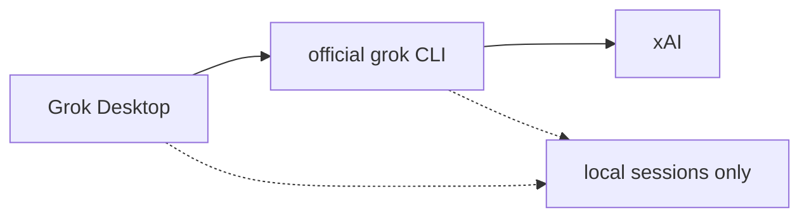

<div align="center">


# Grok Desktop 0.1.6

**官方 Grok CLI 的独立桌面工作区 · Community desktop for the official Grok CLI**

[](https://github.com/AvaterXXX/grok-desktop/releases)
[](https://github.com/AvaterXXX/grok-desktop/releases)
[](https://github.com/AvaterXXX/grok-desktop/stargazers)
[](#from-source)

### ⭐ 喜欢就点一颗 Star

如果这个桌面端帮到你，请点右上角 **Star**。星星是这个社区叉最好的反馈。
If this desktop helps you, tap **Star** — it is the best signal for this community fork.

[⬇️ 下载 Windows 绿色版](https://github.com/AvaterXXX/grok-desktop/releases/latest) · [更新日志](./CHANGELOG.md) · [Issues](https://github.com/AvaterXXX/grok-desktop/issues)

</div>

---

## 隐私 · Privacy

> **本应用不收集、不上传、不记录任何账号 / 对话 / 路径 / 使用数据。**
> 无遥测、无分析、无崩溃上报。登录只走本机官方 `grok` CLI。
> Sessions stay on your machine. The desktop never phones home.

- 账号与额度由本机已登录的官方 Grok CLI 管理
- 对话与会话只存在本机（CLI 会话目录 + 桌面本地设置）
- 删除会话只清本地列表，不会拿你的数据去换云端同步
- 本仓库 **不是** xAI 官方产品

---

## 仓库数据 · Repo stats

| 项目 | 实时徽章 |
|------|----------|
| 最新 Release | [](https://github.com/AvaterXXX/grok-desktop/releases) |
| 累计下载 | [](https://github.com/AvaterXXX/grok-desktop/releases) |
| 本版下载 | [](https://github.com/AvaterXXX/grok-desktop/releases/latest) |
| Stars | [](https://github.com/AvaterXXX/grok-desktop/stargazers) |
| Forks | [](https://github.com/AvaterXXX/grok-desktop/network/members) |
| 源码 | [](https://github.com/AvaterXXX/grok-desktop) |
| 平台 | [](#from-source) |


**仓库只提供 Windows 便携 exe。** Linux / macOS 请自行构建。

---

## 架构 · Architecture



Desktop is a local shell over official CLI. Login/quota stay on this machine.

---

## 0.1.6

| Fix | Note |
|------|------|
| 子代理面板 | 右上角常驻，点开不收，再点收回 |
| 和目标叠放 | 两个都开就上下排，不盖顶栏 |
| 工具卡箭头 | 再加大 |
| 压缩状态 | 不再误锁「正在压缩上下文」 |

## 0.1.5

| Fix | Note |
|------|------|
| 周限额 | 启动画出缓存额度，不再一直是 — |
| 上下文环 | 跟着真实占用走 |
| 子代理 | 只认官方开/关，不再把普通工具当成子代理 |
| 目标 | 清单做完或点暂停，不再自动续跑 |
| 侧栏拖拽 | 对话 / 工程可排序，运行中置顶 |
| 压缩 / 工具卡 | 压缩有状态；箭头更大，方向分清 |

## 0.1.4

| Fix | Note |
|------|------|
| 会话 ID | 正文里的 UUID 原样发出；只有单独 ID 或 `/call` 才切会话 |
| 排队 | 可点开编辑，回车保存，Esc 取消 |
| 子代理 | 输入框上方各占一行，点开看整段记录，不再卡在进行中 |
| 斜杠菜单 | 空格后收起；未入表命令不再显示无匹配 |
| 目标 / 计划 | 输入框上方纸卡片，不再用紫条 |
| 侧栏 | 项目和对话字号、行距加大 |
| 顶栏用量 | 周限额和周用量留下，后面加真·当日 |
| 个人信息 | 默认打开；居中可读宽度；今年 Token 热力图 |
| 助手气泡 | 不再贴复制 / 分叉 / 记记忆 |

## 0.1.3

| Fix | Note |
|------|------|
| 当日标价 | Token 后显示 API 估算金额 |
| 悬停拆账 | 金额上可看 Grok 4.5 / 4.6 各花多少 |
| 每轮用量 | 助手气泡按本轮实际模型展示入/出/缓存 |
| 默认 Extra High | 启动/新对话/恢复不再停在 High |
| 深色对比度 / 浅色壁纸 | 跟主题走 |
| 加载更早 / 重开历史 | 不跳底，看全最后一轮 |
| 用户图片 | 跟在用户消息下 |
| 滚动跟随 | 底部才跟随，上翻有回到最新箭头 |

## 0.1.2 fixes

| Fix | Note |
|------|------|
| 默认 Extra High | 启动/新对话/恢复不再停在 High |
| 深色对比度 | 按钮、周限额、图标、命令完成卡 |
| 浅色壁纸 | 保存后可见 |
| 加载更早 | 不跳回最新 |
| 用户图片 | 跟在用户消息下 |

## 0.1.1 fixes

| Fix | Note |
|------|------|
| 新对话默认任务模式 | 不再残留 /goal |
| 最后一条用户消息 | 可编辑 / 撤回 |
| /effort /model /usage | 斜杠走本地，不当聊天任务 |
| 生成中可排队 | Codex 细条；插队 / 删除 |
| 删会话只清本地 | 不卡 CLI |
| 重启恢复 | 思考/工具卡/目标条 |
| 贴图立刻可见 | paste image shows immediately |
| Diff / 计划条跟主题 | spinner follows system theme |
| 同一轮不重复展示 Grok | 设置可改昵称/头像 |
| 代理回填 | 空保存不覆盖 |
| 长气泡可滚 | 流式不再三重滚动 |

See [CHANGELOG.md](./CHANGELOG.md).

---

## Compare

| | Grok Desktop | Web wrapper | Terminal CLI |
|--|--------------|-------------|--------------|
| Backend | official grok CLI | browser page | official grok CLI |
| Account | local CLI login | web login | local CLI login |
| Multi-session | yes | depends | multiple terminals |
| Queue / edit / retract | built-in | no | no |
| Telemetry | none | web decides | CLI policy |
| Prebuilt package | **Windows exe only** | - | official installer |

---

## Install (Windows)

1. Install and log in to the official **Grok CLI** first.
2. Open [Releases](https://github.com/AvaterXXX/grok-desktop/releases/latest).
3. Download `Grok-Desktop-0.1.6-Windows-Portable-x64.exe` (portable).
4. Unsigned build may trip SmartScreen: More info -> Run anyway.

> This repo **ships Windows exe only**. Linux / macOS: build from source below.

---

<a id="from-source"></a>

## Build from source

Need Node 18+ and Git.

use npmmirror when install is slow

```bash
git clone https://github.com/AvaterXXX/grok-desktop.git
cd grok-desktop
npm install
# Windows: npm run dist:win:portable
# also dist:win, dist:win:setup
# Linux: npm run dist:deb / dist:appimage / dist
# macOS: npm run dist:mac / dist:mac:dir
npm start
```

### Windows

Recommended portable exe: `dist:win:portable`
Also `dist:win` and `dist:win:setup`.

### Linux

No deb/AppImage in GitHub Releases. Build locally with `dist:deb`, `dist:appimage`, `dist`.

### macOS

No dmg/zip in GitHub Releases. Build locally with `dist:mac` and `dist:mac:dir`.

### Artifacts in release/

| OS | script | file |
|----|--------|------|
| Windows | dist:win:portable | Grok-Desktop-0.1.6-Windows-Portable-x64.exe |
| Windows | dist:win:setup | Grok-Desktop-0.1.6-Windows-Setup-x64.exe |
| Linux | dist:deb | grok-desktop_0.1.6_amd64.deb |
| Linux | dist:appimage | Grok-Desktop-0.1.6-x86_64.AppImage |
| macOS | dist:mac | Grok-Desktop-0.1.6-macOS-x64.dmg / .zip |

GitHub Release uploads **Windows portable exe only**.

---

## Disclaimer

This is a **community fork**, not an official xAI product.
Grok / xAI / official CLI belong to their owners.

---

### 喜欢就点一颗 Star

[https://github.com/AvaterXXX/grok-desktop](https://github.com/AvaterXXX/grok-desktop)


If registry is slow:

```bash
npm config set registry https://registry.npmmirror.com
```

